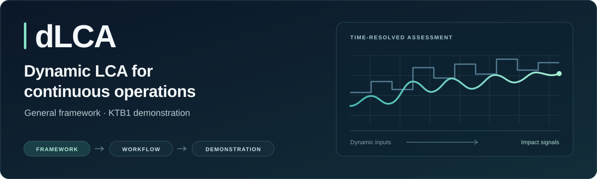
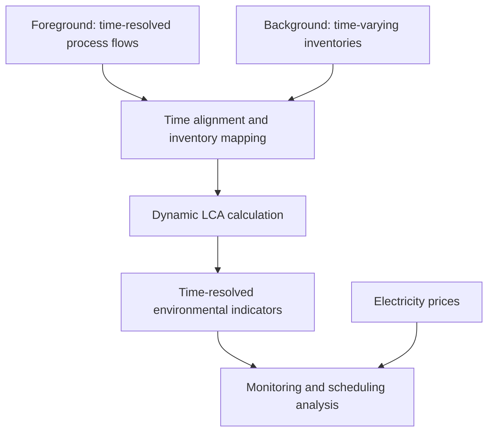

<p align="center">
  
</p>

<h1 align="center">A computational framework for real-time gate-to-gate dynamic LCA of continuous operations</h1>

<p align="center">
  <a href="docs/framework.md"></a>
  <a href="notebooks/README.md"></a>
  <a href="LICENSE"></a>
  <a href="CITATION.cff"></a>
</p>

<p align="center">
  <a href="docs/framework.md">Understand the framework</a> ·
  <a href="notebooks/README.md">Explore the notebooks</a> ·
  <a href="data/README.md">Find the data</a> ·
  <a href="docs/reproduction.md">Reproduce the workflow</a>
</p>

## What this project contributes

This project develops a **general computational framework for time-resolved, gate-to-gate life cycle assessment of continuous operations**. It connects changing process inventories with changing background conditions to produce environmental indicators that can inform operational decisions.

The work has three layers: the mathematical framework, its computational implementation, and a demonstration. **KTB1 continuous lovastatin production is the demonstration, not the boundary of the framework.** The implementation uses MATLAB/Simulink, Python and Brightway, with ENTSO-E electricity data; those choices do not define the general method.

> [!IMPORTANT]
> This is a development companion, not a verified reproduction of the final article. The notebooks are available for inspection, but the full-year inputs, MATLAB interface helper and reconciled result exports are not yet complete. See the [reproduction status](docs/reproduction.md) before running or citing numerical results.

## How it fits together



The process model may contain its own PI/PID regulation. That is separate from an LCA-driven controller: **closed-loop model-predictive control is not implemented here.**

| Layer | General role | Demonstration in this project |
| --- | --- | --- |
| Foreground | Time-resolved process inventory | KTB1 MATLAB/Simulink benchmark |
| Background | Time-varying supply inventories | ENTSO-E electricity-generation data |
| Calculation | Map, align and assess inventories | Python and Brightway with locally licensed ecoinvent |
| Decision analysis | Compare environmental and economic timing | Environmental and price-based campaign scheduling |

## Start here

| Your goal | Open |
| --- | --- |
| Understand the scientific scope | [Framework and scope](docs/framework.md) |
| Inspect the computational workflow | [Notebook guide](notebooks/README.md) |
| Set up a local research environment | [Reproduction guide](docs/reproduction.md) |
| Locate existing data and identify missing inputs | [Data catalogue](data/README.md) |
| Connect article components to code and evidence | [Article-to-repository map](docs/article-map.md) |
| Prepare a publication snapshot | [Release checklist](docs/release-checklist.md) |

### Notebook sequence

1. [MATLAB Engine setup](notebooks/01_matlab_engine_setup.ipynb): installation guidance and release compatibility.
2. [ENTSO-E background](notebooks/02_entsoe_background.ipynb): generation and price retrieval.
3. [Dynamic LCA framework](notebooks/03_dynamic_lca_framework.ipynb): process coupling, impact calculation, scheduling and analysis.

These are cleaned development copies of the supplied notebooks. Stored outputs are removed, configuration is separated from machine-specific paths, and incomplete optional snippets are identified. The numerical model has **not** been silently corrected or revalidated. Exact changes are recorded in the [notebook change log](docs/notebook-changes.md).

### Lightweight repository checks

After cloning this repository, run these commands from its root with Python:

```bash
python -m unittest discover -s tests -v
python scripts/check_repository.py
```

These check repository structure, notebook hygiene, local links and selected credential patterns. They do not execute MATLAB, access ecoinvent, validate the LCA mappings or reproduce scientific results.

<details>
<summary><strong>Repository contents</strong></summary>

| Location | Purpose |
| --- | --- |
| [notebooks/](notebooks/) | Numbered development notebooks and reading order |
| [docs/](docs/) | Scope, reproduction, traceability and release guidance |
| [data/](data/) | Data catalogue and requirements for local inputs |
| [model/](model/) | External KTB1 model and interface requirements |
| [figures/](figures/) | Figure provenance and export requirements |
| [assets/](assets/) | Editable repository artwork |
| [scripts/](scripts/) | Local repository-quality checks |
| [tests/](tests/) | Tests of those checks |
| [.github/](.github/) | Automated checks and contribution templates |

The original root-level CSV, XLSX and DOCX files remain in place to preserve existing links. They are catalogued as legacy material, not relabelled as the final annual dataset.

</details>

## Citation and attribution

Use [CITATION.cff](CITATION.cff) for this repository and record the commit you used. Article DOI and release metadata will be added when confirmed; no publication DOI is implied here.

Project authors: Ada Robinson Medici, Mohammad Reza Boskabadi, Pedram Ramin, Seyed Soheil Mansouri and Stavros Papadokonstantakis. The KTB1 benchmark and other dependencies retain their own attribution; see [third-party sources](docs/third-party-sources.md).

## Licence and third-party material

The repository's existing [GNU GPL version 3 licence file](LICENSE) is retained unchanged. This update does not select a new licence, assign institutional ownership, or change third-party permissions. MATLAB and ecoinvent must be obtained separately under their applicable terms. Do not commit credentials or licensed database exports.

See [Contributing](CONTRIBUTING.md) to report a problem or propose an improvement.
