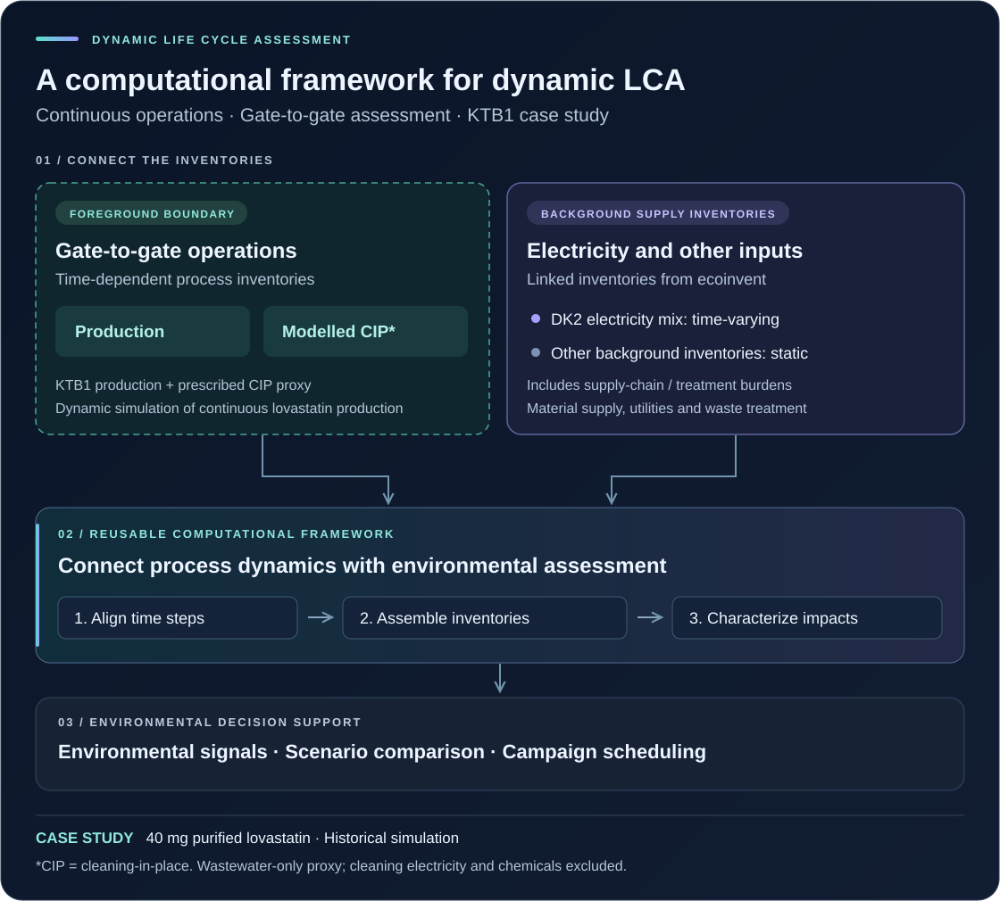
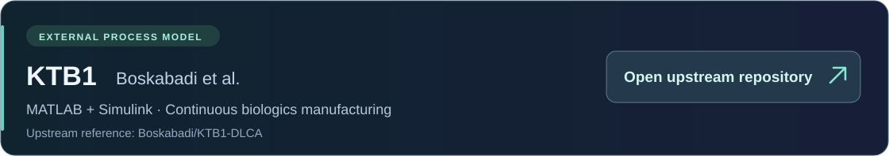
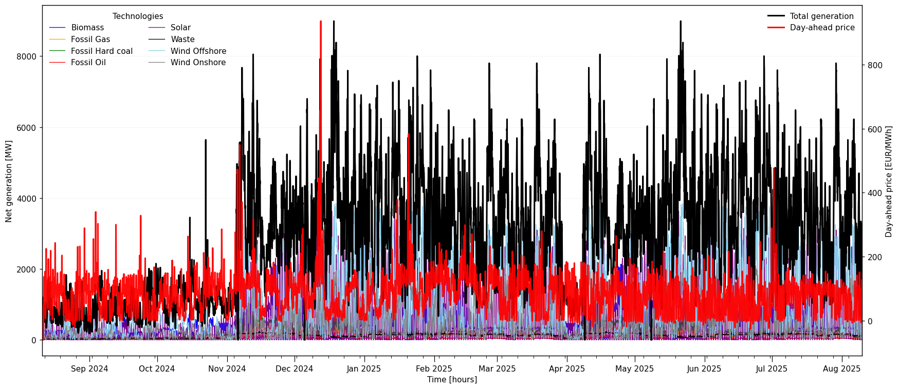
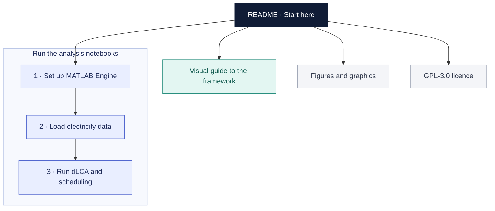

# A Computational Framework for Real-time Gate-to-Gate Dynamic Life Cycle Assessment of Continuous Operations

This repository accompanies the article and implements a general framework for real-time, gate-to-gate dynamic life cycle assessment (dLCA) of continuous operations. The framework couples time-resolved foreground inventories with time-varying background data to generate environmental indicators for monitoring and operational decision support. Continuous lovastatin production provides the case study, using the KTB1 digital twin and hourly electricity data for Denmark's DK2 bidding zone.

**Reading order:** README overview → [visual guide](notebooks/00_Start_here.ipynb) → [analysis notebooks](#notebooks).

[Framework](#what-is-the-contribution) · [LCA boundary](#system-boundary) · [KTB1 case study](#ktb1-a-digital-twin-playground-for-the-case-study) · [Repository map](#repository-map)

## What is the contribution?

| Layer | Role | Scope |
| --- | --- | --- |
| **Framework** | A general mathematical framework for coupling process inventories, time-varying backgrounds and life cycle impact assessment to produce operational environmental signals. | Each application needs its own inventory, units and database mappings. |
| **Implementation** | A Python/Jupyter workflow connecting MATLAB/Simulink, ENTSO-E, Brightway and ecoinvent. | Execution requires the corresponding software, data and database access. |
| **Case study** | Continuous lovastatin production with KTB1 and historical DK2 electricity data, comparing baseline, environmental and price-based campaign schedules. | Simulation-based demonstration; MPC is a future extension. |

## System boundary

**The foreground boundary is gate-to-gate and covers plant operation. Background supply and treatment burdens are included through the mapped ecoinvent datasets.**

| Scope item | Case-study definition |
| --- | --- |
| Foreground boundary | Operation of the continuous production train during production and cleaning-in-place (CIP), including the specified material, utility and waste flows. |
| Background coverage | Supply-chain and treatment burdens associated with the mapped inputs and waste flows. |
| Functional unit | **40 mg of purified lovastatin active pharmaceutical ingredient (API).** |
| Time dependence | Process inventories are paired with hourly DK2 electricity-generation shares. Other background datasets remain static. |
| CIP approximation | **Wastewater treatment only**, excluding cleaning electricity and cleaning-agent inventories. |
| Campaign plan | Nine 600-hour cycles, each comprising 480 hours of production and 120 hours of CIP: **5,400 operating hours** (4,320 production; 1,080 CIP) within an **8,760-hour annual planning window**. |
| Exclusions | Product distribution, use and end-of-life, and a separate inventory of plant construction and capital equipment. Background datasets retain their included burdens. |

## KTB1: a digital twin playground for the case study

**KT-Biologics I (KTB1)**, developed by Boskabadi and colleagues, is a MATLAB/Simulink benchmark for continuous biomanufacturing. Its integrated upstream and downstream models provide a virtual environment for studying process monitoring, optimisation and control. In this case study, KTB1 supplies the dynamic material and energy inventories used by the dLCA framework.

**Model reference:** Boskabadi, M. R.; Ramin, P.; Kager, J.; Sin, G.; Mansouri, S. S. *KT-Biologics I (KTB1): A Dynamic Simulation Model for Continuous Biologics Manufacturing.* Computers & Chemical Engineering **188** (2024), 108770. [DOI: 10.1016/j.compchemeng.2024.108770](https://doi.org/10.1016/j.compchemeng.2024.108770).

[KTB1 model repository](https://github.com/Boskabadi/KTB1) · [KTB1 adaptation for dynamic LCA](https://github.com/Boskabadi/KTB1-DLCA)

## Notebooks

Start with the visual guide for reading. For execution MATLAB setup → ENTSO-E background → main dLCA workflow.

| Notebook | Contents |
| --- | --- |
| [Visual guide](notebooks/00_Start_here.ipynb) | An illustrated introduction to the framework, LCA boundary, KTB1 case study and saved figures. |
| [MATLAB Engine setup](notebooks/Demo%20Install%20or%20Re-install%20MATLAB%20Engine.ipynb) | Install or reinstall the MATLAB Engine interface for Python. |
| [ENTSO-E background data](notebooks/Demo%20A-ENTSOE_python_online_clean.ipynb) | Retrieve electricity-generation and day-ahead price data. |
| [Main dLCA workflow](notebooks/Demo%20dLCA_framework_KTB1_clean.ipynb) | Couple foreground and background inventories, calculate impacts, compare schedules and inspect saved results. |

### Electricity background preview

*Hourly DK2 electricity generation and day-ahead prices. Saved output from the main notebook, cell 30, output 1.*

## Repository map

## Credits and reuse

**Authors:** Ada Robinson Medici, Mohammad Reza Boskabadi, Pedram Ramin, Seyed Soheil Mansouri and Stavros Papadokonstantakis.

**Article:** *A Computational Framework for Real-time Gate-to-Gate Dynamic Life Cycle Assessment of Continuous Operations.* The article link and DOI will be updated after publication.

**Software and data sources:** [KTB1](https://github.com/Boskabadi/KTB1-DLCA) · [Brightway](https://brightway.dev/) · [ecoinvent](https://ecoinvent.org/) · [ENTSO-E Transparency Platform](https://transparency.entsoe.eu/) · MATLAB/Simulink.

**[LICENSE](LICENSE)** — GNU General Public License v3.0 (GPL-3.0), an open-source copyleft licence.
