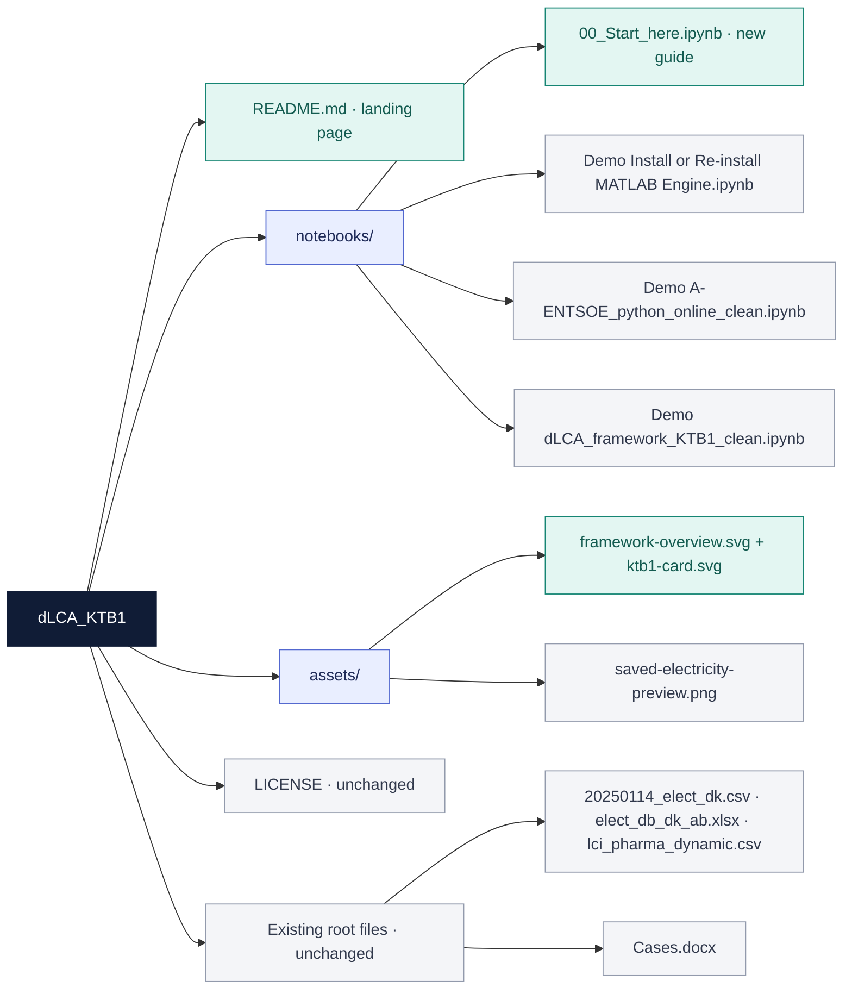

# dLCA · From process dynamics to environmental signals

**A computational framework · an executable workflow · a continuous-biomanufacturing case study**

Pair time-resolved process inventories with time-varying electricity backgrounds to calculate environmental signals for operational decision support. **Lovastatin is the demonstration; the coupling framework is the subject.**

**[▶ Start here: visual walkthrough](notebooks/00_Start_here.ipynb)** · [Original notebooks](#notebooks) · [LCA boundary](#system-boundary) · [Repository map](#repository-map)

*Repository orientation graphic, newly prepared for this guide; not an original manuscript figure. Badge labels describe this repository snapshot, not automated scientific validation.*

## What is the contribution?

| Layer | What belongs here | What it does not establish |
| --- | --- | --- |
| **Framework** | The arrangement for coupling a process inventory, time-varying background information and an LCA engine to generate time-resolved environmental signals. | Transfer to another process is not automatic: its inventories, units, mappings and boundary must be defined. |
| **Implementation** | The supplied Python/Jupyter workflow using Brightway, ecoinvent, ENTSO-E and a MATLAB Engine interface. | A complete, independently reproduced software release is not yet established by this snapshot. |
| **Case study** | A KTB1-based simulation of continuous lovastatin production, paired with historical DK2 electricity data and campaign-calendar scheduling. | This is not a demonstrated live-plant deployment or an implemented closed-loop MPC controller. |

The architecture is intended for sequential updates as new information arrives. The manuscript's case-study method evaluates the historical panel in bulk; hourly resolution alone is not evidence of real-time deployment. Scheduling uses the resulting signals to compare campaign start times, rather than demonstrating physical actuation.

## System boundary

**Gate-to-gate describes the foreground operational boundary—not an exclusion of all upstream background burdens.**

| Scope item | Case-study definition |
| --- | --- |
| Foreground boundary | Operation of the modeled continuous production train, including its production and modeled cleaning-in-place (CIP) blocks and the specified inventory channels. This is not a whole-product cradle-to-grave assessment. |
| Background coverage | Ecoinvent supply and treatment datasets provide the associated background burdens for the mapped inputs and waste flows. The upstream supply chains of those inputs are not physically inside the modeled plant. |
| Functional unit | **40 mg of purified lovastatin API**, as specified in the manuscript. This is a normalization basis, not an assessment of the product's use phase. |
| Time dependence | Process inventories supply the foreground demand. DK2 electricity-generation shares vary hourly; the other background datasets remain static in this demonstration. |
| CIP approximation | The manuscript represents CIP through **a wastewater-only proxy**, excluding CIP electricity and cleaning-agent inventories. This is not a complete cleaning-process inventory. |
| Campaign assumptions | Nine 600-hour cycles: 480 hours production plus 120 hours CIP per cycle, giving 5,400 scheduled operating hours (4,320 production; 1,080 CIP) placed within an annual planning window. Operating hours and planning-window length are different quantities. |
| Outside the stated scope | A full product life cycle, including downstream distribution, use and end-of-life, and a separate assessment of plant construction and capital equipment. Background datasets retain their own included burdens. |

These statements describe the manuscript's intended case-study scope. They do **not** certify that every mapping and saved output in the supplied notebook implements it correctly. The wastewater mapping, temporal coverage and reported numerical results still require reconciliation before a reproduction claim; see [Before running](#before-running).

## KTB1 · the external process model

KTB1 provides the dynamic process-model side of this example; this repository documents the dLCA coupling and analysis. The manuscript describes the model as its digital twin; the evidence supplied here is simulation-based and does not establish a connection to an operating physical plant.

**Model reference:** Boskabadi, M. R.; Ramin, P.; Kager, J.; Sin, G.; Mansouri, S. S. *KT-Biologics I (KTB1): A Dynamic Simulation Model for Continuous Biologics Manufacturing.* Computers & Chemical Engineering **188** (2024), 108770. [DOI: 10.1016/j.compchemeng.2024.108770](https://doi.org/10.1016/j.compchemeng.2024.108770).

[Upstream repository](https://github.com/Boskabadi/KTB1-DLCA) · [Inspected upstream snapshot](https://github.com/Boskabadi/KTB1-DLCA/tree/e84979ff3d7bd750594c7b1fe2db6e1985baac1a)

**Dependency note:** the original notebook calls `KTB1_DLCA1_newvariable_22_legacy` and `step_and_get_DI`. Those exact files were not found in the linked upstream snapshot. That link is attribution and a starting point, **not a verified drop-in replacement**. No Simulink model is copied into this repository.

## Notebooks

Start with the visual guide for reading. For execution, the original dependency order remains MATLAB setup → ENTSO-E background → main dLCA workflow; the main notebook has **not** been split into artificial independently runnable pieces.

| File | Contents | Provenance |
| --- | --- | --- |
| [00_Start_here.ipynb](notebooks/00_Start_here.ipynb) | A short visual reading guide: framework, boundary, model credit, saved figures and links into the originals. No simulation is run. | **New explanatory material.** |
| [Demo Install or Re-install MATLAB Engine.ipynb](notebooks/Demo%20Install%20or%20Re-install%20MATLAB%20Engine.ipynb) | The author's MATLAB Engine setup notebook. | **Original bytes, unchanged.** |
| [Demo A-ENTSOE_python_online_clean.ipynb](notebooks/Demo%20A-ENTSOE_python_online_clean.ipynb) | The author's ENTSO-E retrieval notebook. | **Original bytes, unchanged.** |
| [Demo dLCA_framework_KTB1_clean.ipynb](notebooks/Demo%20dLCA_framework_KTB1_clean.ipynb) | The author's main coupling, LCIA, plotting and scheduling notebook, including saved outputs and errors. | **Original bytes, unchanged.** |

### A preview from the original notebook

*Unmodified saved PNG from the original main notebook, cell 30, output 1 (one-based numbering). It illustrates the background-data view; it was not regenerated or independently validated for this presentation. The original “Time [hours]” axis label is retained although its ticks show calendar dates. Open the [visual guide](notebooks/00_Start_here.ipynb) for context.*

## Repository map

The colored Mermaid diagram below is a **file map**, not a scientific model. Each original notebook remains a single file.

Teal = new explanatory/design material. Gray = preserved material or a saved figure extracted without modification. The three original notebooks are copied from the author-supplied files; the existing root files and `LICENSE` are untouched. No archive, duplicated model repository or additional documentation hierarchy is introduced.

<strong>Existing data and Cases.docx: what are they?</strong>

`20250114_elect_dk.csv`, `elect_db_dk_ab.xlsx`, `lci_pharma_dynamic.csv` and `Cases.docx` were already in the repository. They are retained without modification, not asserted to be the final inputs or final Supporting Information for the revised article. In particular, they do not replace the annual files requested by the main notebook below. No new `data/` folder is added until the article's input files are identified.

## Before running

**This is a readable source snapshot, not yet a verified end-to-end reproduction package.** Viewing the saved figures does not require MATLAB or an ecoinvent installation. Re-executing the workflow does.

<strong>Execution requirements and known gaps</strong>

- **MATLAB/Simulink:** obtain the exact model revision expected by the notebook and its `step_and_get_DI` helper; install a compatible MATLAB Engine. The upstream link alone does not resolve these missing dependencies.
- **Background inventory:** access to the appropriate ecoinvent database and LCIA methods is required. No licensed database is redistributed here. The revised manuscript names v3.11, whereas the previous repository README named v3.10; the database and software environment must be reconciled, not guessed.
- **Annual inputs:** the main notebook reads `entsoe_generation_20250822_184419.csv` and `dk2_price_2024-08-11_2025-08-10.csv`; neither is included in the supplied repository snapshot.
- **Credentials and paths:** the author-supplied notebooks use credential placeholders and contain author-specific local paths. Configure credentials privately and adapt paths in your own working copy; do not commit real keys.
- **Saved execution state:** the main notebook contains saved errors. These are preserved, not cleared to imply a successful run. This presentation update does not execute the scientific workflow.
- **Scientific reconciliation:** date coverage/hour counts, wastewater activity and unit mapping, and saved optimization/independence-analysis outputs must be checked against the revised manuscript. Selected stored numerical results differ from the manuscript; this guide deliberately makes no reproduced percentage-reduction claims.
- **Final article materials:** the revised manuscript and SI are not published as part of this presentation update. Their repository URL and notebook names also need to be aligned with the final accepted release.

<strong>Original-file integrity</strong>

SHA-256 values of the author-supplied notebook files, retained byte-for-byte:

| Notebook | SHA-256 |
| --- | --- |
| MATLAB Engine setup | `7d3fa8b2f4e6bada80915d87623e54374a318520643c97dd572f94786cdb052a` |
| ENTSO-E background | `0bee4fadbdafcd22db1873d19142eb0cc1b9b84e29ad8c8c0635c0f5acd2a30c` |
| Main dLCA workflow | `1a68d3c371851f2eb28cea78ec69d3fda7da4dcb60d3344f68bff655fb047c38` |

## Credits and reuse

**Article team:** Ada Robinson Medici, Mohammad Reza Boskabadi, Pedram Ramin, Seyed Soheil Mansouri and Stavros Papadokonstantakis. The revised manuscript supplied for this repository review is titled *Real-time Dynamic Life Cycle Assessment Framework for a Digital Twin: Case Study in Continuous Biomanufacturing*. No final ACS publication status or DOI is asserted here.

**Dependencies and sources:** [KTB1](https://github.com/Boskabadi/KTB1-DLCA) · [Brightway](https://brightway.dev/) · [ecoinvent](https://ecoinvent.org/) · [ENTSO-E Transparency Platform](https://transparency.entsoe.eu/) · MATLAB/Simulink. External software and datasets retain their own authorship and applicable terms; citation does not replace permission to redistribute them.

**Licence:** the repository's existing [LICENSE](LICENSE) file is unchanged by this presentation update. No change to ownership or third-party licensing is made. The README, visual guide and two SVGs are new presentation material; they do not alter the author's original scientific code or its saved outputs.
